  

# 🛒 Awesome Retail Execution Platform (RetEx)

  
  
  
  
  
  
  

---

## 🌟 Overview & Industry Ecosystem

A curated directory of **Retail Execution Platforms (RetEx)**, **Field Force Automation (FFA)**, **Computer-Vision Shelf Intelligence**, and **Merchandising Compliance** technologies. Designed for Consumer Packaged Goods (CPG) manufacturers, fast-moving consumer goods (FMCG) brands, retail merchandisers, and field sales teams managing store visits, planogram compliance, out-of-stock (OOS) detection, promotion auditing, and route-to-market execution.

> 🔍 **Key Search & SEO Topics**: *Retail Execution Software, CPG Merchandising Compliance, Planogram Auditing, Computer Vision Shelf Monitoring, Sales Force Automation (SFA), Field Service Management, Direct Store Delivery (DSD), Out-of-Stock (OOS) Prevention, Share-of-Shelf (SoS) Analytics, FMCG Route-to-Market.*

---

## 📑 Table of Contents

- [🏢 SaaS & Commercial Hosted Platforms](#-saas--commercial-hosted-platforms)
  - [📊 Sector Market Size & Structure](#-sector-market-size--structure)
  - [📋 SaaS Comparison Table](#-saas-comparison-table)
- [💻 Open-Source GitHub Projects](#-open-source-github-projects)
  - [⭐ Open-Source Ecosystem Ranked by Stars](#-open-source-ecosystem-ranked-by-stars)
  - [🧩 Key Architectural Building Blocks](#-key-architectural-building-blocks)
- [📈 Star History](#-star-history)
- [🤝 How to Contribute](#-how-to-contribute)
- [⚖️ Disclaimer](#️-disclaimer)

---

## 🏢 SaaS & Commercial Hosted Platforms

### 📊 Sector Market Size & Structure

> 💡 **Market Size & Structure**: The global Retail Execution Software market is estimated at **$300M – $330M** (projected to reach **$580M+ by 2034** at a CAGR of ~6.8%, with broader AI-driven shelf monitoring, computer vision, and retail-tech analytics ecosystems expanding into multi-billion dollar valuations). The sector is **moderately to highly fragmented** rather than concentrated into a winner-take-all monopoly—comprising specialized enterprise shelf computer-vision leaders (Trax, FORM), dedicated CPG field CRM suites (Repsly, StayinFront), on-demand crowdsourced audit marketplaces (Field Agent, BeMyEye), and agile regional sales force automation engines (BeatRoute, Teamcore).

### 📋 SaaS Comparison Table

*The table below is sorted descending by **Company Size (Valuation / Revenue)**.*

| Platform | Company Size (Valuation / Revenue) | Description | Pricing (Starting Tier) | Free Tier / Free Trial Limits |
| :--- | :--- | :--- | :--- | :--- |
| **[Trax Retail](https://traxretail.com/)** | **~$2.0B – $2.4B Valuation** • ~$80M–$100M ARR • $1.03B+ raised • Merged with FORM under Gemspring | Computer-vision shelf intelligence & retail execution engine providing automated planogram compliance, share-of-shelf analysis, and out-of-stock alerts. | $15,000/year (~$1,250/month baseline pilot package / approx. $50–$100 per store/month across pilot store cohorts) | 30-day guided Proof of Concept (POC) pilot (scoped to a dedicated test store cluster of up to 50 locations and specific SKU category model training; no permanent free plan). |
| **[YOOBIC](https://yoobic.com/)** | **~$370M – $400M Valuation** • ~$25M–$34M ARR • $80.3M raised • Led by Highland Europe | Frontline employee experience and retail execution platform covering mobile store audits, digital task management, and visual merchandising. | $4/user/month (entry frontline seat tier; deployed for minimum scale of ~100 locations, typically ~$5,000/year) | 14-day guided proof-of-concept (POC) trial (configured for up to 2 retail locations and 10 frontline employees; no permanent free plan). |
| **[FORM MarketX](https://www.form.com/)** *(formerly GoSpotCheck)* | **~$200M – $300M Valuation** • ~$40M–$50M ARR • $71M+ raised prior to exit • Backed by Diversis & Gemspring | Field execution, mobile audit, and image recognition platform for digital checklists, shelf compliance, and photo reporting. | $25/user/month (billed annually with a 20-user minimum subscription, starting at $500/month) | 14-day proof-of-concept (POC) trial (scoped to up to 20 pilot users with full digital checklist and photo audit access; no permanent free plan). |
| **[StayinFront](https://www.stayinfront.com/)** | **~$100M – $150M Est. Valuation** • ~$35.2M ARR • Private equity backed | Field force automation and retail optimization platform (TouchCG) for CPG field sales reps, shelf auditing, and van sales. | $250/month flat baseline (or ~$60/user/month on standard TouchCG field rep licensing with annual contract) | 30-day proof-of-concept / guided pilot program upon sales qualification (restricted to pilot sales territories with core audit workflows; no permanent free plan). |
| **[Field Agent](https://www.fieldagent.net/)** | **~$80M – $120M Est. Valuation** • ~$40.8M ARR • $31M–$50M raised • Backed by Five Elms Capital | On-demand crowdsourced retail auditing marketplace utilizing a nationwide shopper network for shelf audits, display verification, and price checks. | $19.00 per audit response (pay-as-you-go self-serve marketplace; no recurring platform subscription or setup fees) | **Free forever** account registration (unlimited access to marketplace portal, survey builder, and sample audit data; audits charged per response). |
| **[Pepperi](https://www.pepperi.com/)** | **~$60M – $90M Valuation at Exit** • ~$18.1M ARR • Acquired by Advantive (July 2024) | Unified B2B commerce and retail execution suite combining mobile order taking, merchandising, route accounting, and in-store audits. | $500/month (Pro plan baseline; Corporate tier starts at $1,500/month for advanced trade promotions and ERP integration) | 14-day free trial (evaluatable via mobile app demo sandbox with sample catalog data for up to 5 users; no permanent free plan). |
| **[ParallelDots ShelfWatch](https://www.paralleldots.com/shelfwatch)** | **~$50M – $80M Est. Valuation** • ~$39.4M ARR • $6.5M raised • Backed by Btomorrow Ventures | AI-based computer vision solution for shelf auditing, SKU-level share of shelf, eye-level placement, and competitor POSM tracking. | $1,000/month (pilot tier / baseline enterprise contract for image processing clusters; text AI APIs start at $2/1,000 hits) | 30-day guided pilot evaluation (covers custom model training on up to 50 SKUs across a benchmark set of sample shelf photos; no permanent free plan). |
| **[Repsly](https://www.repsly.com/)** | **~$40M Valuation** • ~$10M ARR • $6.3M raised • Backed by Resolve Growth Partners | Retail execution and field team management platform for CPG brands to track merchandising compliance, store visits, and shelf visibility. | $29/user/month (Essentials/Organization tier billed annually; Visibility tier starts at ~$49/user/month) | 14-day free trial (sales-assisted pilot POC with full access to mobile forms, visit scheduling, and manager dashboard for pilot reps; no permanent free plan). |
| **[BeMyEye](https://www.bemyeye.com/)** | **~$30M – $50M Est. Valuation** • ~$8.3M–$16.6M ARR • $21.3M–$44.6M raised • Backed by Nauta & 360 Capital | Crowdsourced European retail execution and shelf compliance platform combining crowdsourced on-demand audits and mobile rep apps. | €500/month (entry subscription tier for crowd-audit campaigns; per-mission rates average €5–€10 per audited location) | 14-day sales-guided pilot / POC program (scoped to a single test city/region with a capped bundle of 20 trial store audits; no permanent free plan). |
| **[Teamcore](https://teamcore.com/)** | **~$20M – $35M Est. Valuation** • ~$5M–$12M ARR • Seed/Growth backed by Accel-KKR | AI-driven smart retail execution platform that transforms POS and store inventory data into prioritized actionable tasks for field teams. | $1,200/month (base enterprise subscription / approximately $15–$25 per store point-of-sale per month for entry retail chains) | 30-day proof-of-concept (POC) pilot (deployed with initial data ingestion for up to 15 retail store points of sale; no permanent free plan). |
| **[BeatRoute](https://beatroute.io/)** | **~$15M – $25M Est. Valuation** • ~$9.7M ARR • $180K seed • Capital-efficient growth | Goal-driven sales force automation (SFA) and retail execution CRM for route planning, order collection, and merchandising compliance. | $8.50/user/month (~₹399/user/month for entry field reps; Startup Program available for teams under 50 reps) | 14-day free trial / guided proof-of-concept (limited to 10 field reps and 1 supervisor with core visit tracking and order taking; no permanent free plan). |
| **[VisitBasis](https://www.visitbasis.com/)** | **~$1M – $3M Est. Valuation** • ~$300K ARR • Bootstrapped / self-funded | Mobile retail audit and merchandising software for store visits, GPS check-ins, custom inspection forms, and photo reporting. | $15/user/month ($12/user/month billed annually; volume discounts available for 50+ users) | **Free forever** for up to 10 users (includes standard mobile forms, photo capture, PDF/Excel reports, and 2-month data retention); 14-day free trial of Premium with unlimited users. |

---

## 💻 Open-Source GitHub Projects

Open-source retail execution platforms are rare as full turnkey products because CPG enterprise workflows require bespoke mobile device management, localized SKU recognition datasets, and deep ERP integrations. However, developers and engineering teams assemble robust retail execution stacks using modular open-source building blocks: mobile inspection frameworks, computer-vision models, enterprise resource planning (ERP), headless commerce backends, and vehicle routing engines.

### ⭐ Open-Source Ecosystem Ranked by Stars

*Repositories are sorted descending by GitHub Star Count.*

1. **[Odoo](https://github.com/odoo/odoo)**   
   Comprehensive open-source business suite with field service, retail POS, barcode scanning, inventory control, and customizable store task workflows.

2. **[ERPNext](https://github.com/frappe/erpnext)**   
   Full-featured open-source ERP offering inventory tracking, retail POS, territory management, and customer visit logging adaptable for retail field operations.

3. **[Medusa](https://github.com/medusajs/medusa)**   
   Modular headless commerce engine with extensible Node.js architecture for powering custom B2B mobile field order taking, trade promotions, and catalog sync.

4. **[Saleor](https://github.com/saleor/saleor)**   
   High-performance GraphQL-native headless commerce platform capable of supporting multi-channel retail ordering and centralized distributor inventories.

5. **[Vendure](https://github.com/vendure-ecommerce/vendure)**   
   Headless TypeScript commerce framework built on NestJS & GraphQL, well-suited for engineering custom field rep replenishment apps and store inventories.

6. **[OSRM (Open Source Routing Machine)](https://github.com/Project-OSRM/osrm-backend)**   
   High-performance C++ routing engine for calculating shortest paths, travel durations, and distance matrices to optimize daily field rep store visit routes.

7. **[metasfresh](https://github.com/metasfresh/metasfresh)**   
   Fast open-source ERP platform built for wholesale distribution, order processing, and supply chain execution with field sales capabilities.

8. **[Form.io](https://github.com/formio/formio)**   
   Enterprise form builder and JSON-powered data management platform for generating complex retail audit forms, merchandising surveys, and inspection checklists.

9. **[VROOM](https://github.com/VROOM-Project/vroom)**   
   Open-source vehicle and field force routing optimization engine that solves Vehicle Routing Problems (VRP) to sequence daily store audits efficiently.

10. **[Apache OFBiz](https://github.com/apache/ofbiz-framework)**   
    Battle-tested enterprise automation suite featuring warehouse operations, order fulfillment, and retail point-of-sale integration.

11. **[SKU110K](https://github.com/eg4000/SKU110K_CVPR19)**   
    Pioneering CVPR benchmark dataset and deep-learning object detection models specifically engineered for detecting densely packed products on supermarket shelves.

12. **[ODK Collect](https://github.com/getodk/collect)**   
    Standard open-source offline-first Android field data collection tool supporting GPS geotagging, barcodes, audits, photo capture, and complex skip logic.

13. **[OpenRetail](https://github.com/rudi-krsoftware/open-retail)**   
    Lightweight open-source retail and POS management software engineered for small-to-medium retail store operations.

14. **[KoboToolbox KPI](https://github.com/kobotoolbox/kpi)**   
    Web application for authoring, publishing, and managing field inspection forms, mobile audit questionnaires, and field research surveys.

15. **[SaleFlex](https://saleflex.dev/)**  
    Modular open-source retail foundation providing POS, back-office administration, and API hubs for store-level operational execution.

---

### 🧩 Key Architectural Building Blocks

When engineering a custom internal retail execution stack, teams frequently combine:
- 📱 **Offline-First Mobile Apps**: Tools using SQLite/WatermelonDB/ODK for store audits in low-connectivity retail basements.
- 👁️ **Computer Vision & OCR**: YOLOv8/v11, SKU110K object detectors, and OpenCV models fine-tuned on FMCG brand packaging for planogram adherence.
- 🗺️ **Routing & Scheduling Engines**: OSRM, VROOM, and OpenRouteService for territory planning and multi-stop visit itineraries.
- 📦 **Master Data & Inventory ERP**: ERPNext, Odoo, or Medusa for centralized SKU catalogs, pricing tier rules, and store profiles.
- 📊 **BI & Compliance Dashboards**: Apache Superset, Metabase, and Grafana for visualizing out-of-stock rates, share-of-shelf (SoS), and field visit KPIs.

---

## 📈 Star History

---

## 🤝 How to Contribute

1. 🍴 Fork the repository.
2. 📝 Add or edit entries in `README.md` keeping formatting factual, objective, and linked to official websites.
3. 📦 For SaaS entries, provide specific starting tier prices, accurate company size metrics, and precise free tier / trial terms.
4. ⭐ For open-source repos, include the star badge linked to the stargazers page and ensure proper star-count descending order.
5. 🚀 Submit a Pull Request (PR) with a brief description of the addition.

---

## ⚖️ Disclaimer

- This repository is a **community-curated directory** for research, benchmarking, and educational purposes—not an endorsement or advertisement.
- Financial metrics, company valuations, and starting tier prices are compiled from publicly available disclosures, venture capital databases, and industry reports as of 2026.
- In-store retail audits, photo capture, and planogram intelligence must comply with local privacy regulations and store policies.

---

  <b>Built with ❤️ for CPG Field Teams, Retail Merchandisers, Route-to-Market Practitioners, and Retail-Tech Engineers.</b>

